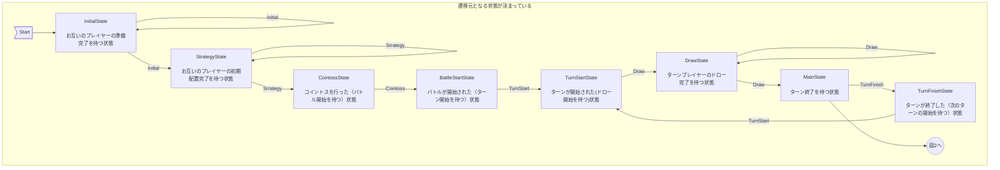
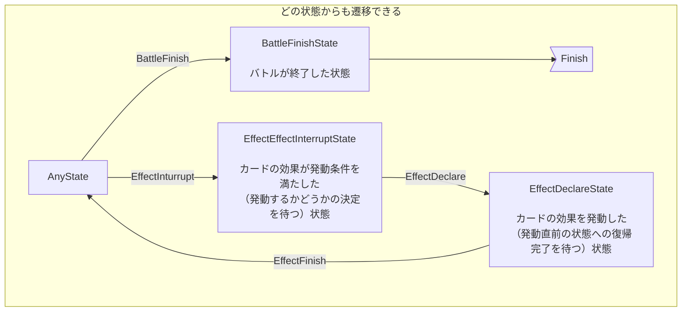
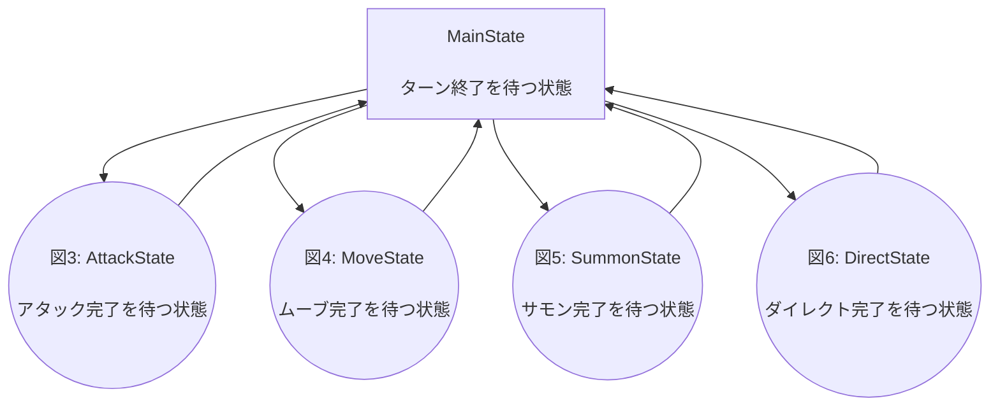
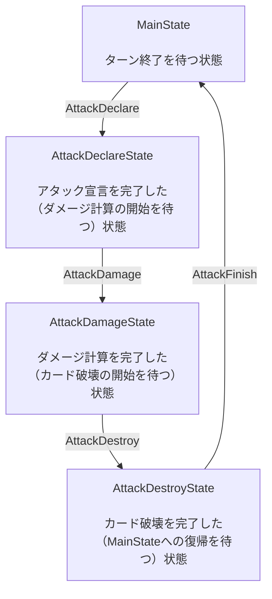
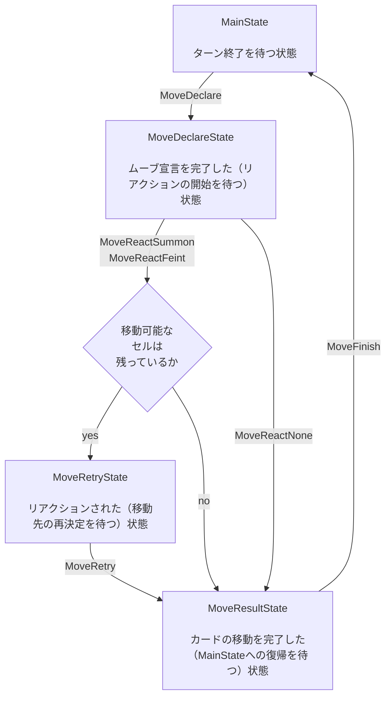
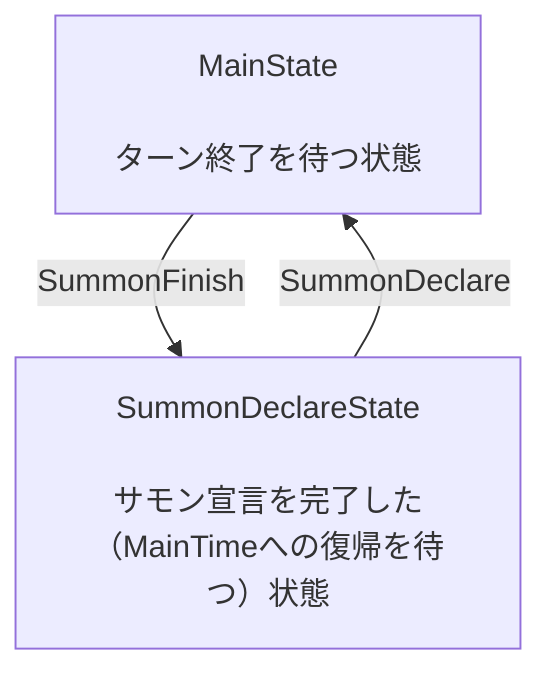
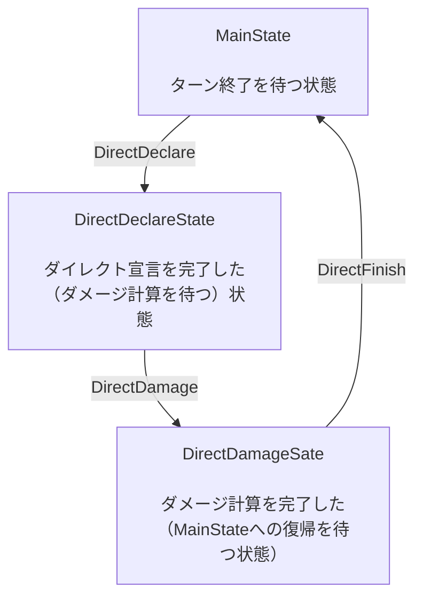
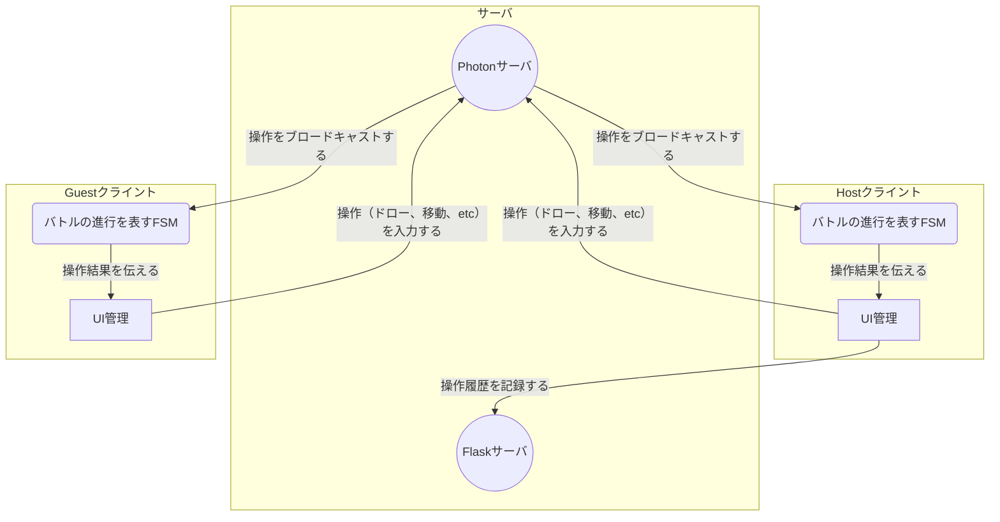
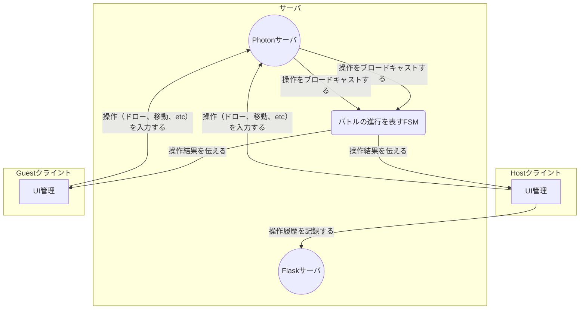

## バトル進行モデルの解説

図1: 全体図

```mermaid
graph TD

subgraph 遷移元となる状態が決まっている
start>Start]
i[InitialState<br><br>お互いのプレイヤーの準備完了を待つ状態]
st[StrategyState<br><br>お互いのプレイヤーの初期配置完了を待つ状態]
ct["CointossState<br><br>コイントスを行った（バトル開始を待つ）状態"]
bs["BattleStartState<br><br>バトルが開始された（ターン開始を待つ）状態"]
ts["TurnStartState<br><br>ターンが開始された(ドロー開始を待つ)状態"]
d["DrawState<br><br>ターンプレイヤーのドロー完了を待つ状態"]
m["MainState<br><br>ターン終了を待つ状態"]
tf["TurnFinishState<br><br>ターンが終了した（次のターンの開始を待つ）状態"]
zu2((図2へ))
end

start-->i
i-->|Initial|i
i-->|Initial|st
st-->|Srrategy|st
st-->|Srrategy|ct
ct-->|Cointoss|bs
bs-->|TurnStart|ts
ts-->|Draw|d
d-->|Draw|d
d-->|Draw|m
m-->|TurnFinish|tf
tf-->|TurnStart|ts

m-->zu2

```

```mermaid
graph TD

subgraph どの状態からも遷移できる
any[AnyState]
bf["BattleFinishState<br><br>バトルが終了した状態"]
ei["EffectEffectInterruptState<br><br>カードの効果が発動条件を満たした<br>（発動するかどうかの決定を待つ）状態"]
ed["EffectDeclareState<br><br>カードの効果を発動した<br>（発動直前の状態への復帰完了を待つ）状態"]
finish>Finish]
end

any-->|BattleFinish|bf
bf-->finish
any-->|EffectInturrupt|ei
ei-->|EffectDeclare|ed
ed-->|EffectFinish|any
```

図2: MainStateの詳細

```mermaid
graph TD

m["MainState<br><br>ターン終了を待つ状態"]
attack((図3: AttackState<br><br>アタック完了を待つ状態))
move((図4: MoveState<br><br>ムーブ完了を待つ状態))
summon((図5: SummonState<br><br>サモン完了を待つ状態))
direct((図6: DirectState<br><br>ダイレクト完了を待つ状態))

m-->attack
attack-->m

m-->move
move-->m

m-->summon
summon-->m

m-->direct
direct-->m

```

図3: AttackStateの詳細

```mermaid
graph TD

m["MainState<br><br>ターン終了を待つ状態"]
ad1["AttackDeclareState<br><br>アタック宣言を完了した（ダメージ計算の開始を待つ）状態"]
ad2["AttackDamageState<br><br>ダメージ計算を完了した（カード破壊の開始を待つ）状態"]
ad3["AttackDestroyState<br><br>カード破壊を完了した（MainStateへの復帰を待つ）状態"]

m-->|AttackDeclare|ad1
ad1-->|AttackDamage|ad2
ad2-->|AttackDestroy|ad3
ad3-->|AttackFinish|m


```

図4: MoveStateの詳細

```mermaid
graph TD

m["MainState<br><br>ターン終了を待つ状態"]
md["MoveDeclareState<br><br>ムーブ宣言を完了した（リアクションの開始を待つ）状態"]
check{移動可能な<br>セルは<br>残っているか}
mrt["MoveRetryState<br><br>リアクションされた（移動先の再決定を待つ）状態"]
mre["MoveResultState<br><br>カードの移動を完了した（MainStateへの復帰を待つ）状態"]


m-->|MoveDeclare|md
md-->|MoveReactSummon<br>MoveReactFeint|check
check-->|yes|mrt
check-->|no|mre
md-->|MoveReactNone|mre
mrt-->|MoveRetry|mre
mre-->|MoveFinish|m

```

図5: SummonStateの詳細

```mermaid
graph TD

m["MainState<br><br>ターン終了を待つ状態"]
sd["SummonDeclareState<br><br>サモン宣言を完了した（MainTimeへの復帰を待つ）状態"]

sd-->|SummonDeclare|m
m-->|SummonFinish|sd

```

図6: DirectStateの詳細

```mermaid
graph TD
m["MainState<br><br>ターン終了を待つ状態"]
dd1["DirectDeclareState<br><br>ダイレクト宣言を完了した（ダメージ計算を待つ）状態"]
dd2["DirectDamageSate<br><br>ダメージ計算を完了した（MainStateへの復帰を待つ状態）"]

m-->|DirectDeclare|dd1
dd1-->|DirectDamage|dd2
dd2-->|DirectFinish|m
```

## 修正前のバトル進行モデル

```mermaid
graph TD

subgraph サーバ
photon((Photonサーバ))
flask((Flaskサーバ))
end

subgraph Hostクライント
h1[UI管理]
h2(バトルの進行を表すFSM)
end

subgraph Guestクライント
g1[UI管理]
g2(バトルの進行を表すFSM)
end

g2-->|操作結果を伝える|g1
h2-->|操作結果を伝える|h1
h1-->|"操作（ドロー、移動、etc）を入力する"|photon
g1-->|"操作（ドロー、移動、etc）を入力する"|photon
photon-->|操作をブロードキャストする|h2
photon-->|操作をブロードキャストする|g2
h1-->|操作履歴を記録する|flask
```

## 高修正したいバトル進行モデル

```mermaid
graph TD

subgraph サーバ
photon((Photonサーバ))
flask((Flaskサーバ))
fsm(バトルの進行を表すFSM)
end

subgraph Hostクライント
h1[UI管理]
end

subgraph Guestクライント
g1[UI管理]
end

fsm-->|操作結果を伝える|g1
fsm-->|操作結果を伝える|h1
h1-->|"操作（ドロー、移動、etc）を入力する"|photon
g1-->|"操作（ドロー、移動、etc）を入力する"|photon
photon-->|操作をブロードキャストする|fsm
photon-->|操作をブロードキャストする|fsm
h1-->|操作履歴を記録する|flask
```
